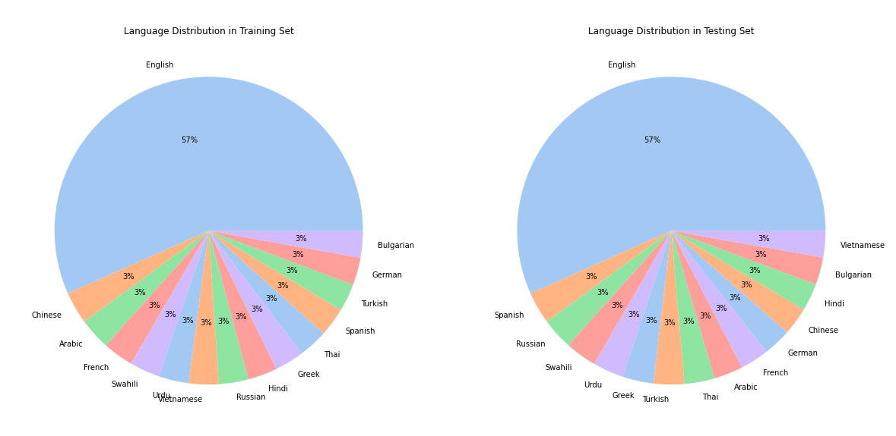
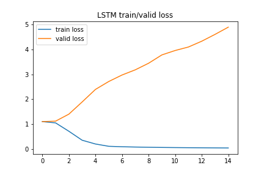

# Multilingual-Contradiction-Detection
#### Team: [Yoli Wu](https://github.com/hereisyoli), [Young Zeng](https://github.com/youngzyx/)

[The slides](https://github.com/youngzyx/Multilingual-Contradiction-Detection/blob/main/my_dear_watson.pdf)

## Goal
Classifying pairs of sentences (consisting of a premise and a hypothesis) into three categories - entailment, contradiction, or neutral.  

## Dataset
* the train and test set include text in 15  different languages:
  * Arabic, Bulgarian, Chinese, German, Greek, English, Spanish, French, Hindi, Russian, Swahili, Thai, Turkish, Urdu, and Vietnamese.
* Train: 12120(2.77 MB) (include premise, hypothesis, language, label)
* Test: 5195(1.18 MB)
 

Link: https://www.kaggle.com/competitions/contradictory-my-dear-watson/data 

### Example
#### Premise:
`He came, he opened the door and I remember looking back and seeing the expression on his face, and I could tell that he was disappointed.`

#### Hypothesis 1:
`Just by the look on his face when he came through the door I just knew that he was let down.` 
We know that is true based on the information in the premise, so this pair is related by **entailment**.

#### Hypothesis 2:
`He was trying not to make us feel guilty but we knew we had caused him trouble.` 
We can't know if it is true based on the premise, therefore the relationship is **neutral**

#### Hypothesis 3:
`He was so excited and bursting with joy that he practically knocked the door off it's frame.`  
We know that is not true given the information on the premise, hence the relationship of this pair is **contradiction**

## Models
### [BERT](https://huggingface.co/docs/transformers/model_doc/bert#tfbertmodel)
[Notebook](https://github.com/youngzyx/Multilingual-Contradiction-Detection/blob/main/nlp_tensorflow_BERT.ipynb)
 `bert-base-multilingual-cased`
> This model uses a pre-trained model, multilingual BERT model from huggingface and incorporate the BERT transformer into a Keras Functional Model.
 
* Valid Loss: 0.823
* Valid Accuracy: 0.637

### [XLM-RoBERTa](https://huggingface.co/joeddav/xlm-roberta-large-xnli)
[Notebook](https://github.com/youngzyx/Multilingual-Contradiction-Detection/blob/main/xlm_Roberta.ipynb)
> This model takes xlm-roberta-large and fine-tunes it on a combination of NLI data in 15 languages. It is intended to be used for zero-shot text classification, such as with the Hugging Face ZeroShotClassificationPipeline.  

* Valid Loss: 0.064
* Valid Accuracy: 0.896
* Scores 

|Label|Precision|Recall|F-score|Support|
|:----|:-------:|:-----:|:-----:|-----:|
|0|0.904|0.306|.0905|822|
|1|0.874|0.858|0.866|769|
|2|0.908|0.921|0.914|833|

### LSTM
[Notebook](https://github.com/youngzyx/Multilingual-Contradiction-Detection/blob/main/lstm_final.ipynb)

* Valid Loss: 1.099
* Valid Accuracy: 0.024
 
From the loss and accuracy plots below, we can observe that LSTM is doing bad on this problem.

## Result

|Model|Valid_Loss|Valid_Accuracy| 
|:----|:--------:|---------:|
|BERT|0.823|0.637|
|XLM-RoBERTa|0.064|0.896|
|LSTM|1.099|0.024|

## Reference
* https://www.kaggle.com/code/k170040024/contradictory-my-dear-watson-pytorch-xlmr
#### Tips
**NLI** (Natural language inference) model is a model that attempts to infer the correct label based on the two sentences.
  
